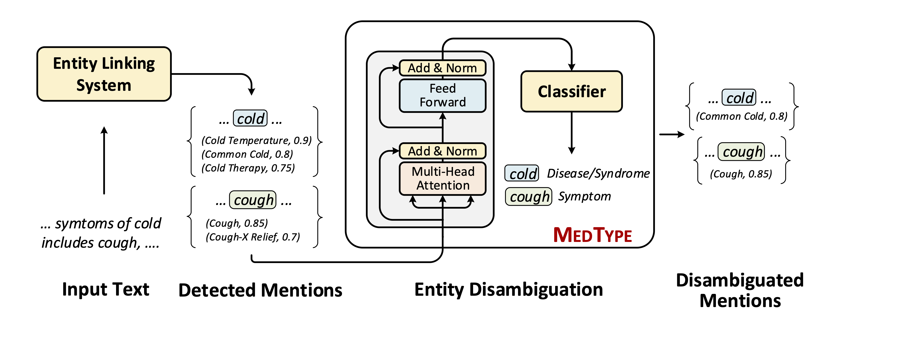
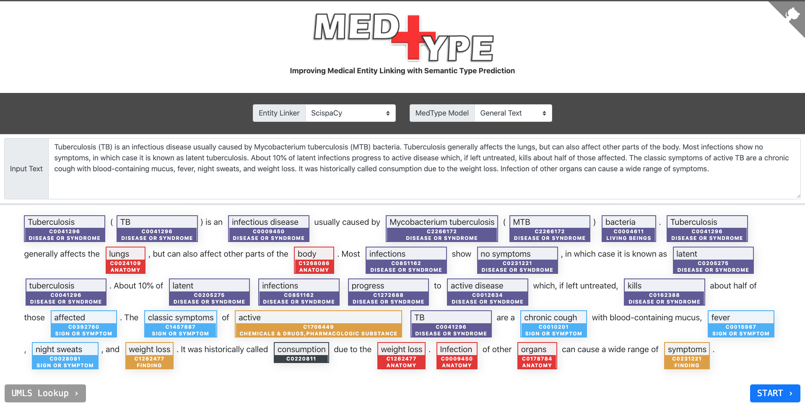

<h1 align="center">
  
</h1>


<h4 align="center">Improving Medical Entity Linking with Semantic Type Prediction</h4>

<p align="center">
  <a href="https://arxiv.org/abs/2005.00460"></a>
  <a href="https://medtype.github.io"></a>
  <a href="https://github.com/svjan5/medtype/blob/master/LICENSE">
    
  </a>
</p>

Note: Please send an [email](svashish@andrew.cmu.edu) for requesting an updated version of the paper.

<h2 align="center">
  What is MedType?
</h2>

**MedType** is a BERT-based entity disambiguation module which can be incorporated with an any existing medical entity linker for enhancing its performance. For a given input text, **MedType** takes in the set of identified mentions along with their list of candidate concepts as input. Then, for each mention **MedType** predicts its semantic type based on its context in the text. The identified semantic type is utilized to disambiguate extracted mentions by filtering the candidate concepts. The figure below summarizes the entire process. The results demonstrate that **MedType** achieves state-of-the-art performance for medical entity linking task. Please refer to the paper for more details. 



<h1 align="center">
  Contents
</h1>

We make the following resources available in this repository:

* **medtype-as-service** is inspired by [**bert-as-service**](<https://github.com/hanxiao/bert-as-service>) which provides a scalable implementation of BERT model for encoding thousands of documents in seconds. **medtype-as-service** on similar lines helps to scale **MedType** by serving a pretrained **MedType** model through an API. Basically, **medtype-as-service** takes in a list of variable-length text and returns entity linking output in the following form:

  ```json
  Input: ["Symptoms of common cold includes cough, fever, high temperature and nausea."]
  Output: 
  [
      {
          "text": "Symptoms of common cold includes cough, fever, high temperature and nausea.",
          "mentions":[
              {
                  "mention": "Surface form of mention",
                  "start_offset": "Character offset indicating start of the mention",
                  "end_offset": "Character offset indicating end of the mention",
                  "predicted_type": ["List containing predicted semantic types for the mention"],
                  "candidates": ["Contains list of [CUI, Score] pairs given by base entity linker"],
                  "filtered_candidates": ["Contains MedType output: filtered list of [CUI, Score] pairs based on mention's predicted semantic types"]
              },
              {}
          ]
      }   
  ]
  ```

  * We provide three pre-trained models for tackling different domain:
    - [**General text**](https://drive.google.com/file/d/1OJ66mvs5yw_EcOEaVEvABzMAWRAsoqR9/view?usp=sharing) (trained on WikiMed)
    - [**Bio-Medical Research Articles**](https://drive.google.com/file/d/1XuFx5_q_6PCYQXNHb50DBc3PhJn2Gy1D/view?usp=sharing) (trained on WikiMed+PubMedDS+Annotated PubMed abstracts)
    - [**Electronic Health Records (EHR)**](https://drive.google.com/file/d/1OJ66mvs5yw_EcOEaVEvABzMAWRAsoqR9/view?usp=sharing) (trained on WikiMed+PubMedDS+Annotated EHR documents)
  * Currently, we provide support with the following entity linkers: cTakes, MetaMap, MetaMapLite, QuickUMLS, and ScispaCy. 
  * Instructions for runing **medtype-as-service** follow the instructions given in the readme.md
  * Similar to bert-as-service, **medtype-as-service** is :telescope: **State-of-the-art**, :hatching_chick: **Easy-to-use**, :zap: **Fast**, :octopus: **Scalable**, and :gem: **Reliable**.

* **medtype-trainer** is for training a MedType model from scratch which can be later used by medtype-as-service. All the details for training and evaluation code for entity linking is provided in `./medtype-trainer`. 

  * **[Online Demo available](https://medtype.github.io)** :fire:


* **Datasets!** We make the datasets proposed in the paper publicly available.

  * Both **WikiMed**, **PubMedDS** are in `JSON` format with one document per line. Each document has the following structure:

    ```json
    {
        "_id":  "A unique identifier of each document",
        "text": "Contains text over which mentions are ",
        "title": "Title of Wikipedia/PubMed Article",
        "split": "[Not in PubMedDS] Dataset split: <train/test/valid>",
        "mentions": [
            {
                "mention": "Surface form of the mention",
                "start_offset": "Character offset indicating start of the mention",
                "end_offset": "Character offset indicating end of the mention",
                "link_id": "UMLS CUI. In case of multiple CUIs, they are concatenated using '|', i.e., CUI1|CUI2|..."
            },
            {}
        ]
    }
    ```
  * The datasets are uploaded on Google Drive: [WikiMed](https://drive.google.com/open?id=16suJCinjfYhw1u1S-gPFmGFQZD331u7I), [PubMedDS](https://drive.google.com/file/d/16mEFpCHhFGuQ7zYRAp2PP3XbAFq9MwoM/view?usp=sharing). We also make two public datasets [MedMentions](https://drive.google.com/open?id=1E_cSs3GJy84oATsMBYE7xMEoif-f4Ei6) and [NCBI Disease corpus](https://drive.google.com/open?id=1SawFWcHgXSwQu-CA5tb46XCbNRIXo4Sf) also available in the same format. All the datasets can be downloaded using the following script:

    ```shell
    ./download_datasets.sh
    ```
   * **Datasets statistics:** (Different from arxiv paper)
 
   | Datasets | \#Docs | \#Sents | \#Mentions | #Unq Concepts |
   | -------- | ------ | ------- | ---------- | ------------- |
   | NCBI    | 792    | 7,645    | 6,817    | 1,638 |
   | Bio CDR    | 1,500    | 14,166    | 28,559    | 9,149 |
   | Sharecorpus    | 431    | 27,246    | 17,809    | 1,719 |
   | MedMentions    | 4,392    | 42,602    | 352,496    | 34,724 |
   | **WikiMed** | **393,618** | **11,331,321** | **1,067,083** | **57,739** |
   | **PubMedDS** | **13,197,430** | **127,670,590**  |  **57,943,354** | **44,881** |


<h2 align="center">
  Citation
</h2>

Please consider citing our paper if you use this code in your work.

```bibtex
@ARTICLE{medtype2020,
       author = {{Vashishth}, Shikhar and {Joshi}, Rishabh and {Dutt}, Ritam and
         {Newman-Griffis}, Denis and {Rose}, Carolyn},
        title = "{MedType: Improving Medical Entity Linking with Semantic Type Prediction}",
      journal = {arXiv e-prints},
     keywords = {Computer Science - Computation and Language},
         year = 2020,
        month = may,
          eid = {arXiv:2005.00460},
        pages = {arXiv:2005.00460},
archivePrefix = {arXiv},
       eprint = {2005.00460},
 primaryClass = {cs.CL},
       adsurl = {https://ui.adsabs.harvard.edu/abs/2020arXiv200500460V},
      adsnote = {Provided by the SAO/NASA Astrophysics Data System}
}
```

For any clarification, comments, or suggestions please create an issue or contact [Shikhar](http://shikhar-vashishth.github.io).

### Acknowledgements:

This work was funded in part by NSF grant IIS **1917668** and funding from Dow Chemical and UPMC/Abridge.
